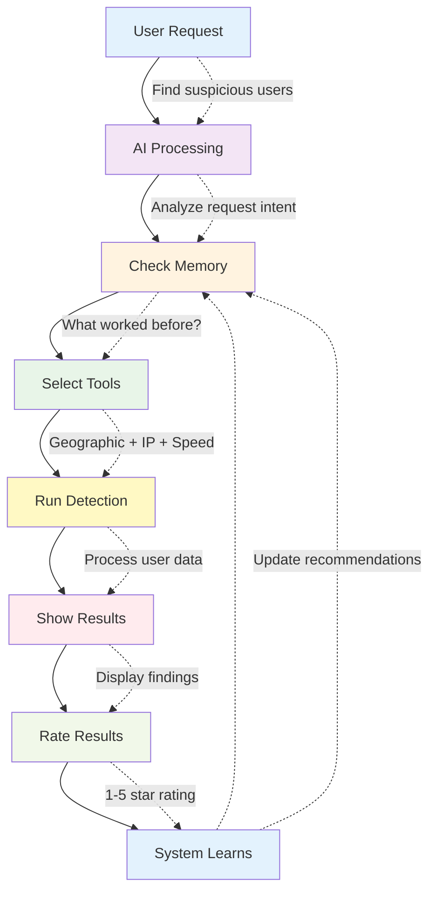

# User Intent Classification System

## Goal
The goal was to create a multi agent system capable of finding out which agent to use based on user prompt. There are multiple agentic frameworks like OpenAI's swarm which assist in easily setting up agents, however it doesn't allow the user to modify how the model will go about deciding which agent to use.
I've tried to do so by adding additional information to each agent to add more context around their usage. On top of this, a continuous feedback learning loop is implemented by reranking predictions based on user feedback. 
Basically, the application is able to "change" its selections by checking which agent has worked better for this type of query in the past and can build more confidence on its selections. This helps the application understand the intent behind the prompt and come up with suitable agent classifications in order to achieve the desired goal.


## What does it do?

I've used the domain of fraud detection to create the agents. The same can be extended for any usecase.
The system helps you catch fraudulent users by automatically selecting the right detection tools based on your request. It gets smarter over time by learning from your feedback.

### Simple Example:

- **You ask:** "Find users with suspicious locations"
- **System:** Runs geographic and IP analysis tools
- **You get:** List of potentially fraudulent users
- **You rate:** How good were the results (1-5 stars)
- **System learns:** Uses your feedback to improve future recommendations

## How It Works



## Available Detection Tools

| 🔍 Tool               | What it catches                         |
| --------------------- | --------------------------------------- |
| 🌍 Geographic Checker | Users appearing in impossible locations |
| 🌐 IP Analyzer        | Suspicious network patterns             |
| ⚡ Speed Detector     | Unnaturally fast user actions           |

## Quick Start

1. **Setup:** Add your OpenAI API key to `.env` file
2. **Start:** Run `docker-compose up -d`
3. **Use:** Run `docker-compose exec intent-classification-system python main.py`
4. **Ask:** Type requests like "check for location anomalies"
5. **Rate:** Give feedback to help the system learn

## Sample Questions You Can Ask

- "Find users with suspicious geographic activity"
- "Check for IP address anomalies"
- "Detect users completing actions too quickly"
- "Run all fraud detection tools"

That's it! The system handles the rest automatically.

---

## Technical Setup Details

### Prerequisites

- Docker and Docker Compose
- OpenAI API Key

### Environment Setup

Create a `.env` file:

```bash
API_KEY=your-openai-api-key-here
```

### Commands

```bash
# Start the system
docker-compose up -d

# Run the application
docker-compose exec intent-classification-system python main.py

# Check system status
docker-compose ps

# Stop the system
docker-compose down
```

### Data Storage

- All your data stays on your computer (Milvus database)
- System learns from your feedback locally

## Support

If something doesn't work:

1. Check `docker-compose ps` to ensure services are running
2. Look at logs: `docker-compose logs intent-classification-system`
3. Restart: `docker-compose restart`
